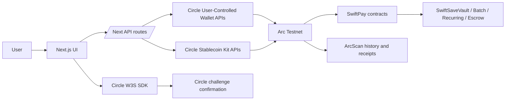

# SwiftPay Circle Submission Video Guide

Target length: 4:30-5:00.

## Recording Rules

- Do not show `.env`, API keys, Circle entity secrets, private keys, or user tokens.
- Keep the code walkthrough focused on files that implement Circle/USDC behavior.
- Use Arc Testnet throughout the demo.
- If a live Circle confirmation is unavailable, show the implemented flow and state clearly that the confirmation would open through the Circle W3S challenge modal.

## 5-Minute Script

### 0:00-0:20 - Product Context

"SwiftPay is a stablecoin payments app for Arc Testnet. Users can connect either an external EVM wallet or a Circle user-controlled embedded wallet, then send, receive, request, swap, batch, escrow, save, and schedule USDC/EURC payments."

Show:

- `README.md`
- App running at `/dashboard`

Say this directly:

- "SwiftPay settles on Arc Testnet by default."
- "USDC is not just the payment asset here. On Arc, USDC is also the gas token."

### 0:20-1:45 - Codebase Walkthrough

Show these files in this order.

1. `apps/web/lib/wagmi.ts`

Say this directly:

- "This is the network layer."
- "Arc Testnet is hardcoded here as chain `5042002`."
- "The native currency is USDC, so gas is paid in USDC."
- "ArcScan is wired here, which is why every payment can produce an explorer-backed receipt."

2. `apps/web/lib/tokens.ts`

Say this directly:

- "This is the token registry SwiftPay uses in the app."
- "USDC on Arc Testnet is `0x3600000000000000000000000000000000000000`."
- "EURC is supported beside USDC."
- "Both tokens use 6 decimals, so all payment math is stablecoin-native."

3. `apps/web/components/circle-google-login.tsx`

Say this directly:

- "This is the Circle embedded wallet entry point."
- "SwiftPay uses Circle's W3S web SDK."
- "Google login gives us the Circle `userToken` and `encryptionKey`."
- "Before login, we create a Circle device token."
- "After login, we initialize the Circle wallet on Arc Testnet."
- "Then we load the user's Circle wallet and token balances."

4. `apps/web/app/api/circle/user-wallets/route.ts`

Say this directly:

- "This route is the Circle W3S backend."
- "The Circle API key never goes to the browser."
- "The frontend asks for named actions; this route validates them and calls Circle."
- "`createTransfer` is the direct Circle wallet payment path."
- "`createContractExecution` is the Circle wallet smart contract path."
- "That is how embedded wallets send USDC and also interact with SwiftPay contracts."

5. `apps/web/app/api/circle/[...circlePath]/route.ts`

Say this directly:

- "This route is only for Circle Stablecoin Kit swap traffic."
- "It forwards only three allowed endpoints: quote, swap, and swap status."
- "The Kit key stays server-side."
- "This prevents the browser from becoming a general-purpose Circle API proxy."

6. `apps/web/app/dashboard/page.tsx`

Say this directly:

- "This is the main product flow."
- "The dashboard chooses between Circle embedded wallet mode and external wallet mode."
- "When Circle mode is active, balances come from Circle."
- "`handleCirclePaymentAction` creates the Circle transfer challenge."
- "The user confirms that challenge through the Circle W3S SDK."
- "If Circle does not return a hash immediately, SwiftPay polls Circle and recovers it."
- "Once the hash is known, the app shows ArcScan links and a receipt."

7. `apps/web/lib/save/circle-vault.ts` and `apps/web/lib/save/spend-save-browser.ts`

Say this directly:

- "This is where Circle powers contract execution, not just transfers."
- "Spend&Save encodes ERC-20 approval calldata."
- "Then it encodes `SwiftSaveVault.deposit` or `SwiftSaveVault.withdraw`."
- "External wallets sign directly through wagmi."
- "Circle wallets use `createContractExecution` and confirm through a Circle challenge."
- "Same product workflow, two wallet execution paths."

8. `apps/web/swap/browser.ts`

Say this directly:

- "This is the Circle AppKit swap integration."
- "External wallets use Circle AppKit through a viem adapter."
- "Circle embedded wallets use a custom adapter."
- "That adapter turns AppKit write requests into Circle `createContractExecution` challenges."
- "Quotes and swap execution go through the `/api/circle` proxy, so the Kit key stays off the client."

9. `packages/scripts`

Say this directly:

- "These are operational Circle scripts."
- "`create-wallet.ts` and `batch-wallets.ts` use Circle Developer Controlled Wallets."
- "`send/index.ts` sends USDC through Circle AppKit."
- "`swap/index.ts` swaps USDC to EURC through Circle AppKit."
- "`bridge/index.ts` demonstrates USDC bridge flow into Arc Testnet."
- "These scripts prove the integration is not limited to the UI."

10. `packages/contracts/contracts`

Say this directly:

- "These contracts are the SwiftPay payment rails."
- "`SwiftBatch.sol` batches USDC/EURC payments and charges a 1% platform fee."
- "`SwiftRecurepayExecutor.sol` executes approved recurring stablecoin payments."
- "`SwiftSaveVault.sol` holds non-interest-bearing USDC/EURC savings pockets."
- "Circle wallets reach these contracts through `createContractExecution`."

### 1:45-2:25 - Architecture Summary

Narration:

"The frontend never calls Circle with secret credentials directly. The client stores the user-controlled wallet session, then calls a Next.js route. The server route adds the Circle API key or Kit key, validates the requested action, and forwards only the allowed Circle operations. Direct payments use Circle W3S transfers. Contract-backed features use Circle W3S contract execution. Swaps use Circle AppKit and Stablecoin Kit through the server proxy."

Supporting diagram:



### 2:25-4:20 - Integration Demo

Recommended demo path:

1. Open `/`.
2. Click "Continue with Google" in the Circle wallet panel.
3. Show wallet creation/loading state.
4. Open `/dashboard`.
5. Show active "Circle wallet" mode and USDC/EURC balances.
6. Enter a recipient wallet or `@username`.
7. Enter a small USDC amount.
8. Click "Send with Circle wallet".
9. Explain that Circle returns a transfer challenge and the W3S SDK opens the confirmation.
10. After confirmation, show transaction status, ArcScan link, and receipt.
11. If Spend&Save is active, show the second Circle confirmation for the savings deposit.
12. Open the swap panel in the dashboard, show USDC to EURC quote, then explain execution through Circle AppKit.

Fallback demo if a live wallet confirmation is not available:

- Show `/dashboard` with the Circle wallet mode.
- Show `handleCirclePaymentAction` in `apps/web/app/dashboard/page.tsx`.
- Show the exact request body sent to `createTransfer`.
- Show `circleSdkRef.current.execute(challenge.challengeId, ...)`.
- Show `recoverCirclePaymentTxHash`.
- Show `apps/web/lib/save/circle-vault.ts` for the contract execution challenge path.
- Mention: "This is implemented; the only part I am not executing in this recording is the live Circle challenge because it requires an authenticated Circle wallet session."

Optional CLI demo:

```sh
pnpm send
pnpm swap
pnpm bridge
pnpm create-wallet
pnpm batch-wallets
```

Only run these in the video if the environment is funded and configured. Otherwise, show the scripts and describe their intended operational role.

### 4:20-4:50 - Implemented vs Planned Circle Products

Implemented:

- USDC and EURC transfers on Arc Testnet.
- Circle User-Controlled Wallets via W3S SDK and server-side W3S API proxy.
- Circle W3S `createTransfer` for embedded wallet payments.
- Circle W3S `createContractExecution` for vault and swap-related contract calls.
- Circle AppKit swap integration in the web app.
- Circle AppKit send/swap/bridge scripts.
- Circle Developer Controlled Wallet scripts for wallet creation and token transfer.

Partially implemented or operational-script only:

- Bridge/CCTP-style USDC movement is present as `packages/scripts/bridge/index.ts`, not yet exposed as a full product UI.
- Gateway/Unified Balance is not wired into the current app. The intended approach is to add it behind the same server-side Circle proxy pattern, then expose unified balances in the dashboard before payment execution.

### 4:50-5:00 - Close

"That is the full Circle-powered SwiftPay flow: Circle wallet onboarding, USDC settlement on Arc, Circle-backed transfers and contract execution, Circle AppKit swaps, and supporting operational scripts for wallets, send, swap, and bridge."

## Quick File Reference

- `apps/web/lib/wagmi.ts`
- `apps/web/lib/tokens.ts`
- `apps/web/components/circle-google-login.tsx`
- `apps/web/app/api/circle/user-wallets/route.ts`
- `apps/web/app/api/circle/[...circlePath]/route.ts`
- `apps/web/app/dashboard/page.tsx`
- `apps/web/lib/save/circle-vault.ts`
- `apps/web/lib/save/spend-save-browser.ts`
- `apps/web/swap/browser.ts`
- `packages/scripts/create-wallet.ts`
- `packages/scripts/batch-wallets.ts`
- `packages/scripts/send/index.ts`
- `packages/scripts/swap/index.ts`
- `packages/scripts/bridge/index.ts`
- `packages/scripts/send-tokens.ts`
- `packages/contracts/contracts/SwiftBatch.sol`
- `packages/contracts/contracts/SwiftRecurepayExecutor.sol`
- `packages/contracts/contracts/save/SwiftSaveVault.sol`

## Suggested Submission Description

Private video link: `<paste unlisted/private video URL>`

Supporting documentation:

- `docs/circle-video-walkthrough.md`
- `README.md`

Summary:

"SwiftPay uses Circle User-Controlled Wallets for embedded Google-login wallets, Circle W3S APIs for transfers and contract execution, Circle AppKit for swaps and operational send/bridge scripts, and USDC/EURC on Arc Testnet as the payment assets. The demo shows Circle wallet onboarding, USDC payment execution, transaction recovery/receipt display, and the Circle-backed contract execution path for Spend&Save."
