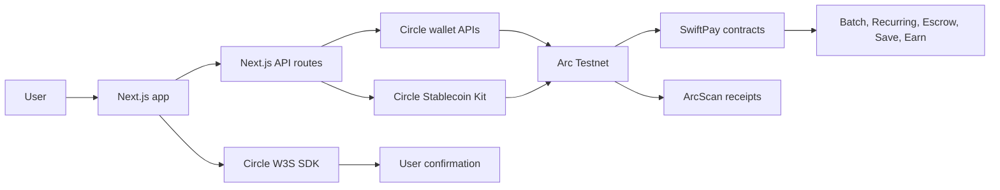

# SwiftPay Investor Deck

## Slide 1 - SwiftPay

Stablecoin payments that feel like everyday finance.

SwiftPay turns USDC and EURC on Arc into a usable payment workspace for wallets, invoices, batch payouts, recurring payments, private escrow, swaps, and savings pockets.

Circle-powered wallet onboarding. USDC-native settlement. Product workflows beyond simple transfers.

---

## Slide 2 - Stablecoins are liquid, but still hard to use day to day

Stablecoin adoption has outgrown the product layer most users actually need.

- Wallet onboarding still loses mainstream users.
- Payments often stop at a raw address transfer.
- Receipts, beneficiaries, payment links, recurring flows, and refunds are fragmented.
- Teams need batch and scheduled payments without building treasury tooling.
- Privacy-sensitive payments need escrow workflows, not public direct sends.

The opportunity is not only more stablecoin issuance. It is making stablecoins operational.

---

## Slide 3 - SwiftPay is the product layer for stablecoin money movement

SwiftPay bundles the workflows that make USDC useful after a wallet is funded.

- Send, receive, and request USDC or EURC.
- Sign in with a Circle embedded wallet or connect an external wallet.
- Save beneficiaries and route payments to wallet addresses or usernames.
- Generate ArcScan-backed transaction receipts.
- Swap between USDC and EURC.
- Run batch payouts and recurring stablecoin payments.
- Use private claim-code escrow when a direct public transfer is not the right flow.
- Move funds into non-interest savings pockets with Spend&Save.
- Put idle USDC to work through SwiftPay Earn, an ERC-4626 vault with an Aave-compatible strategy path.

SwiftPay is a payments app, treasury tool, and stablecoin wallet experience in one product surface.

---

## Slide 4 - The market is already moving toward programmable dollar rails

Public market signal is strong.

| Signal | Why it matters |
| --- | --- |
| More than $272B in global circulating stablecoin supply | Stablecoins are already a major liquidity layer |
| $10.2T in adjusted stablecoin transaction volume over the last 12 months | Stablecoins are no longer a niche transfer rail |
| USDC reported at $72.3B in circulation as of July 27, 2026 | Circle infrastructure is one of the largest regulated stablecoin networks |
| Arc launched public testnet with USDC-native fees and sub-second finality | The chain is designed for payments, FX, capital markets, and onchain economic activity |

Sources: Visa Onchain Analytics, Circle USDC, Circle Arc public testnet announcement.

---

## Slide 5 - The wedge is emerging-market and internet-native payments

SwiftPay starts where stablecoins already solve a painful problem: fast, dollar-denominated value transfer.

Initial users:

- Freelancers and remote teams that need dollar payments and receipts.
- Small businesses that need batch payouts without bank-like treasury tooling.
- Internet-native operators that already hold stablecoins but lack payment workflows.
- Users in high-friction payment markets who need predictable digital dollar settlement.

The product expands from direct payments into recurring payments, privacy escrow, savings automation, Earn, and multi-currency stablecoin workflows.

---

## Slide 6 - Circle gives SwiftPay a credible wallet and settlement foundation

SwiftPay is built around Circle infrastructure instead of treating stablecoin payments as raw RPC calls.

- Circle User-Controlled Wallets power Google-based embedded wallet onboarding.
- Circle W3S `createTransfer` powers direct USDC and EURC payments.
- Circle W3S `createContractExecution` powers vault deposits, withdrawals, approvals, and contract workflows.
- Circle AppKit powers swap flows in the web app and operational send, swap, and bridge scripts.
- Circle Developer Controlled Wallet scripts support operational wallet creation and token transfer workflows.
- Arc Testnet uses USDC as the native gas token, so fees are dollar-denominated.
- SwiftPay Earn keeps USDC as the underlying asset while routing deposits through an ERC-4626 vault and strategy adapter.

This gives SwiftPay a clean path from testnet validation to production-grade stablecoin infrastructure.

---

## Slide 7 - Product architecture

SwiftPay keeps secrets server-side and routes Circle operations through controlled backend actions.

The browser never receives the Circle API key or Kit key. The API layer validates named actions and forwards only the required Circle calls.

---

## Slide 8 - The product is already built beyond a prototype

SwiftPay has working implementation across the full payment surface.

| Area | Current status |
| --- | --- |
| Circle embedded wallet login | Implemented with Circle W3S SDK and Google login |
| Direct USDC/EURC payments | Implemented through Circle W3S transfers and external wallet ERC-20 transfers |
| Swap flow | Implemented through Circle AppKit and a server-side Circle proxy |
| Payment requests and receipts | Implemented with QR links, usernames, ArcScan history, and receipt UI |
| Batch payments | Implemented with `SwiftBatch.sol` and UI |
| Recurring payments | Implemented with scheduler, API routes, and `SwiftRecurepayExecutor.sol` |
| Private payments | Implemented with claim-code escrow |
| Swift+Save | Implemented with non-interest pockets and Circle contract execution support |
| SwiftPay Earn | Implemented as an ERC-4626 USDC vault with Aave-compatible strategy, APY/status routes, admin health, history, and auto-save plumbing |

The main gap is not product construction. It is beta distribution, compliance hardening, and production rollout.

---

## Slide 9 - Earn turns payments into retained balances

SwiftPay Earn is the retention layer for users who receive and hold USDC.

What is built:

- ERC-4626 USDC vault.
- Aave-compatible strategy adapter.
- Simulation mode for Arc testnet and live mode once verified market addresses are configured.
- APY/status endpoints that avoid hard-coded yield claims.
- Admin health view for TVL, fees, strategy status, deposits, and withdrawals.
- Auto-save plumbing that can route user-approved USDC into Earn.

Important guardrail:

- SwiftPay Earn does not claim guaranteed yield.
- Performance fees apply only to positive yield above the vault high-water mark, not to deposits.
- On-chain vault balances are the source of truth.

Why it matters:

Earn gives SwiftPay a reason for users to keep balances in the product after a payment lands.

---

## Slide 10 - Current traction is product readiness, not inflated vanity metrics

SwiftPay is currently at the testnet and product-validation stage.

What has been achieved:

- End-to-end Circle wallet onboarding is implemented.
- USDC and EURC payment flows are live in the app on Arc Testnet.
- Contract-backed payment rails are built and wired to the UI.
- Circle AppKit swaps are integrated in the web app.
- Operational scripts exist for Circle wallet creation, send, swap, bridge, and token transfer flows.
- ArcScan-backed transaction history and receipts are implemented.
- SwiftPay Earn is implemented with vault, strategy, APY, admin, history, and auto-save components.

What is not being claimed yet:

- No production MAU.
- No production AUM.
- No scaled live transaction volume.

Next beta metrics:

- Active wallets.
- Successful payment volume.
- Payment success rate.
- Weekly retained users.
- Savings pocket balances.
- Earn deposits, withdrawals, TVL, and retained balances.
- Recurring payment schedules created.

---

## Slide 11 - Real traction instrumentation is now built into the product

SwiftPay now tracks actual usage instead of relying on modeled traction.

| Metric | Source of truth | Why it matters |
| --- | --- | --- |
| Registered wallets | Profiles table | Shows onboarding growth |
| Active wallets | `traction_events` actors over a selected period | Measures repeat usage, not one-time wallet creation |
| Stablecoin volume | Payment and swap events | Proves USDC/EURC movement through the product |
| Indexed Earn AUM | Earn deposits and withdrawals | Measures retained USDC balances |
| Savings AUM | Savings deposits and withdrawals | Measures non-interest retained balances |
| Monthly transactions | Tracked payment and swap transaction hashes | Shows payment frequency |
| Recurring schedules | Recurring schedules table | Validates automated payment behavior |
| Payment success rate | Submitted vs failed payment events | Confirms operational reliability |

Admin surfaces:

- `/admin/traction`
- `GET /api/admin/traction?rangeDays=30`
- `POST /api/traction/events`

The beta goal is simple: grow the real dashboard, not a spreadsheet.

---

## Slide 12 - Business model

SwiftPay can monetize payment workflows without taxing basic wallet access.

Primary revenue streams:

- Platform fee on batch, recurring, and private escrow payments.
- Performance fee on positive Earn yield, never on deposits.
- Premium payment operations for teams and businesses.
- Swap or FX spread where allowed and transparently disclosed.
- Business account features: roles, limits, approvals, exports, and reporting.
- Future API access for payment requests, payout automation, and receipts.

The model starts with workflow fees and expands into stablecoin payment operations for teams.

---

## Slide 13 - Roadmap

The next phase turns the working testnet product into a measured private beta.

Near term:

- Run private beta with funded testnet and pilot users.
- Add production analytics around active wallets, volume, retention, and failed-payment reasons.
- Harden wallet session management, monitoring, alerts, and reconciliation.
- Convert bridge scripts into a user-facing bridge route.
- Move Earn from simulation to live mode only after verified Arc and Aave market addresses are available.
- Add business payment exports and team-friendly controls.

After beta:

- Production deployment on supported Circle and Arc infrastructure.
- Compliance review for target markets and supported payment flows.
- Distribution partnerships with freelancer, creator, and small-business communities.
- Expand API and treasury tooling for teams.

---

## Slide 14 - Investment ask

SwiftPay is raising to move from built product to measured distribution.

Use of funds:

- Private beta operations and pilot acquisition.
- Security review, monitoring, and reconciliation hardening.
- Compliance and market readiness.
- Production wallet and Circle infrastructure rollout.
- Earn strategy review, vault monitoring, and risk controls.
- Business payment features: teams, exports, approvals, limits, and API access.

The bet: stablecoin payments will be won by products that make USDC operational, trusted, retained, and repeatable for real users.

---

## Source Links

- Visa stablecoin market figures: https://corporate.visa.com/en/solutions/crypto/stablecoins/stablecoins-and-the-future-of-onchain-finance.html
- Circle USDC circulation and network claims: https://www.circle.com/usdc
- Circle Arc public testnet announcement: https://www.circle.com/pressroom/circle-launches-arc-public-testnet
- Circle USDC contract addresses: https://developers.circle.com/stablecoins/usdc-contract-addresses
- Arc contract address and USDC native model notes: https://docs.arc.io/arc/references/contract-addresses
- Arc deployment docs, USDC gas note: https://docs.arc.io/arc/tutorials/deploy-on-arc
- SwiftPay Circle technical walkthrough: `docs/circle-video-walkthrough.md`
- SwiftPay Earn implementation notes: `README.md`, `packages/contracts/contracts/earn/`, `apps/web/lib/earn/`, `apps/web/app/earn/page.tsx`
